# 간단한 홈페이지 입니다.

## PPT (그림을 클릭하세요)

### 홈페이지 기능

1. 유저 리스트 보기
2. 페이징 기능
3. 회원가입
3-1. 적용 모습
4. 로그인
5. 상세보기
6. 삭제
7. 관리자 로그인
7-1 관리자 유저정보 확인
7-2 관리자 유저 삭제
7-3 관리자 정보 확인 불가
8. 인젝션 방지

	
###  1. 유저 리스트 보기

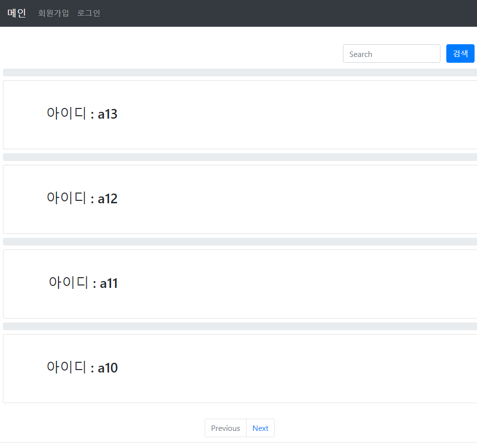

###  2. 페이징 기능
- 한페이지당 4명씩 출력

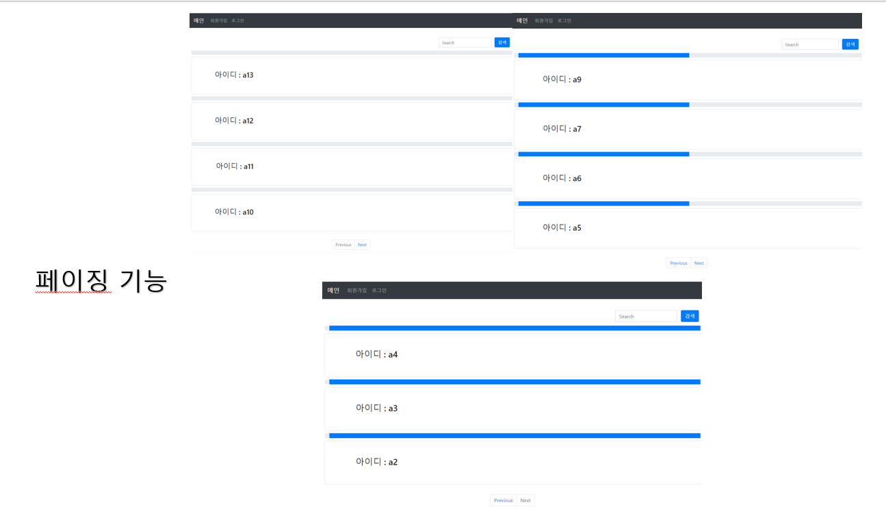

### 3. 회원가입
- 아이디, 비밀번호, 이메일을 적고 회원가입  
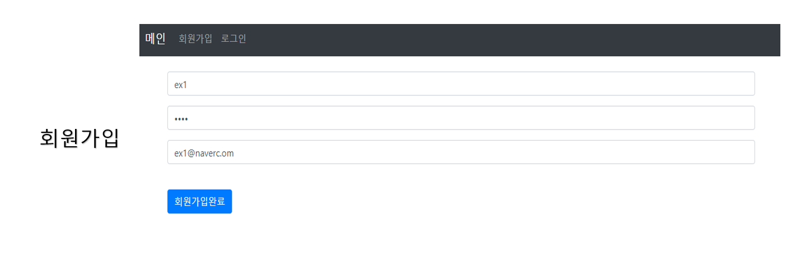

### 3-1. 적용모습
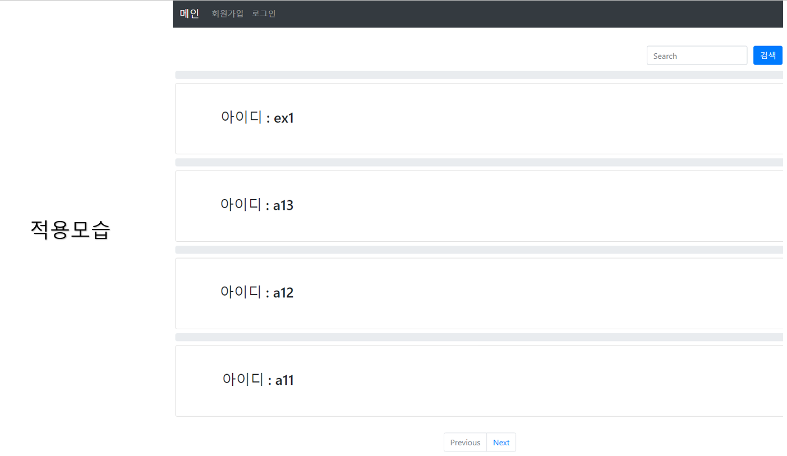

### 4. 로그인
- 로그인한 사용자만 정보 확인
- 상세보기 버튼 활성화
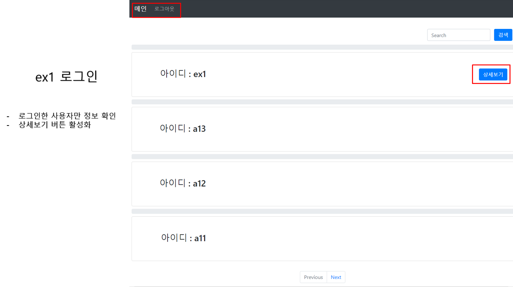

### 5. 상세보기
- 세션id와 게시글 작성자가 같을때 삭제버튼 활성화
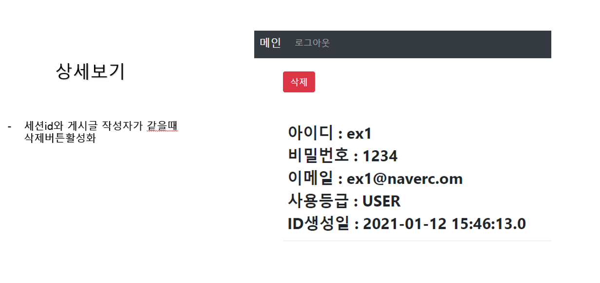

### 6.삭제
- 아이디가 ex1인것 삭제
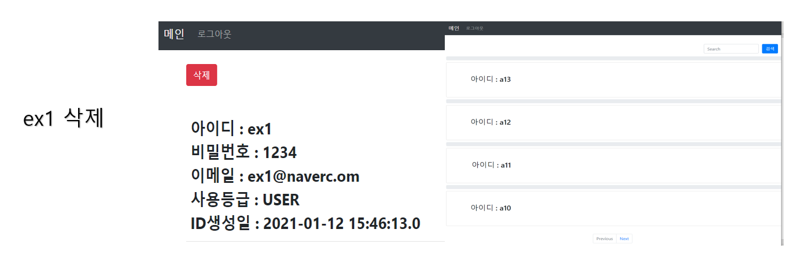

### 7. 관리자 로그인
- 관리자 아이디로 접속
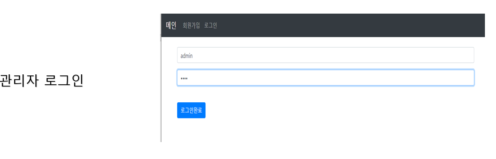

### 7-1. 관리자 유저정보 확인
- 관리자는 모든 유저정보를 확인하고 지울 수 있다
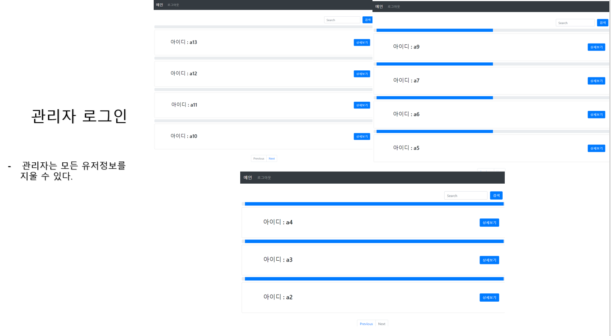

### 7-2 관리자 유저 삭제
- 아이디가 a7유저 삭제
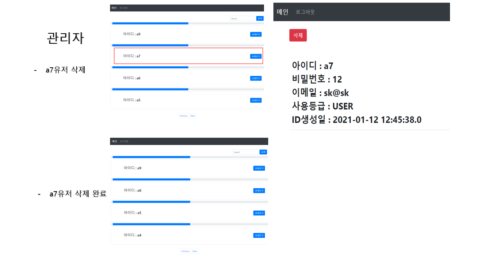 
### 7-3 관리자 정보 확인 불가
- 관리자 정보는 유저리스트에서 확인 불가
- sql문을 이용하여 구현
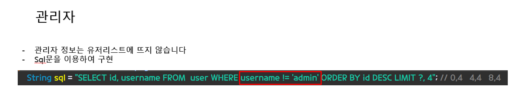
### 8. Injection공격 대비
- <,>를 바꿔서 출력 
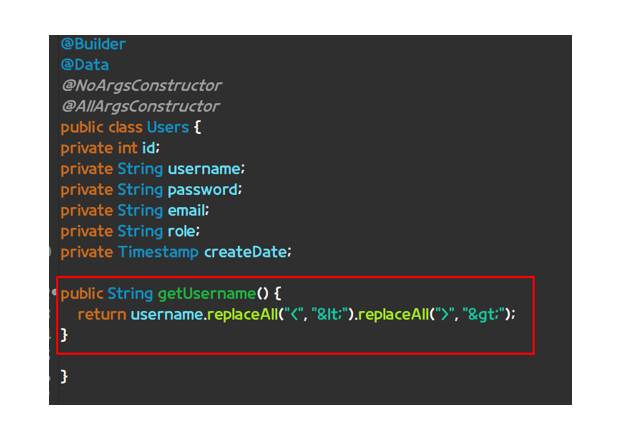

블로그 주소 : https://blog.naver.com/skjin20800
